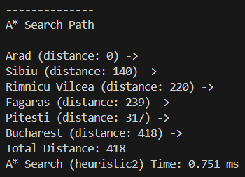

# AI Assignment 1: Search Algorithms on the Romania Roadmap

## Overview

This project implements several classical search algorithms on the Romania roadmap problem, a standard example from artificial intelligence. The roadmap is represented as a weighted undirected graph, and the algorithms find paths between cities using different strategies and heuristics.


## Implemented Algorithms

- **Breadth-First Search (BFS):** Explores the graph level by level, guaranteeing the shortest path in terms of the number of edges.
    - Time Complexity: O(V + E)
    - Space Complexity: O(V)
- **Depth-First Search (DFS):** Explores as far as possible along each branch before backtracking.
    - Time Complexity: O(V + E)
    - Space Complexity: O(V)
- **Best-First Search:** Uses a heuristic (straight-line distance or triangle inequality) to prioritize nodes that appear closer to the goal.
    - Time Complexity: O(E + V log V)
    - Space Complexity: O(V)
- **A\* Search:** Combines path cost and heuristic to efficiently find the shortest path.
    - Time Complexity: O(E + V log V)
    - Space Complexity: O(V)

## Heuristics

The straight-line distances (SLD) from the Romanian cities to Bucharest were used to provide data for these heuristic functions. 
```python
sld_to_bucharest = {
    "Arad": 366, 
    "Bucharest": 0, 
    "Craiova": 160, 
    "Drobeta": 242,
    "Eforie": 161, 
    "Fagaras": 176, 
    "Giurgiu": 77, 
    "Hirsova": 151,
    "Iasi": 226, 
    "Lugoj": 244, 
    "Mehadia": 241, 
    "Neamt": 234,
    "Oradea": 380, 
    "Pitesti": 100, 
    "Rimnicu Vilcea": 193,
    "Sibiu": 253, 
    "Timisoara": 329, 
    "Urziceni": 80, 
    "Vaslui": 199,
    "Zerind": 374
}
```
- **Heuristic 1:** Uses the absolute difference in straight-line distances (SLD) to Bucharest between the current city and the goal.
- **Heuristic 2:** Uses the triangle inequality, estimating the SLD between any two cities as the sum of their SLDs to Bucharest or the direct road distance if available.

## Expected Outputs for Arad -> Bucharest

Note: The cities outputted are the ones that are searched on the way to the destination, not necessarily the route to the destination

### BFS


### DFS


### Best-FS Heuristic1


### Best-FS Heuristic2


### A* Heuristic1


### A* Heuristic2


## Runtime Data

Timing is measured using Python's `time` library and reported in milliseconds.

Each search algorithms' runtimes were recorded and tabulated below.

| Run | BFS (ms) | DFS (ms) | BestFS (h1) (ms) | BestFS (h2) (ms) | A* (h1) (ms) | A* (h2) (ms) |
|:---:|:--------:|:--------:|:----------------:|:----------------:|:------------:|--------------|
| 1   | 0.778    | 0.619    | 0.419            | 0.521            | 0.550        | 0.292        |
| 2   | 0.622    | 0.317    | 0.340            | 0.417            | 0.446        | 0.335        |
| 3   | 0.862    | 0.600    | 0.646            | 0.579            | 0.569        | 0.596        |
| 4   | 0.762    | 0.385    | 0.333            | 0.324            | 0.414        | 0.635        |
| 5   | 0.710    | 0.526    | 0.456            | 0.451            | 0.665        | 0.554        |
| 6   | 0.679    | 0.389    | 0.341            | 0.347            | 0.414        | 0.357        |
| 7   | 0.892    | 0.610    | 0.550            | 0.491            | 0.649        | 0.751        |
| 8   | 0.830    | 0.708    | 0.503            | 0.558            | 0.516        | 0.465        |
| 9   | 0.669    | 0.356    | 0.527            | 0.566            | 0.582        | 0.390        |
| 10  | 0.887    | 0.653    | 0.769            | 0.689            | 0.764        | 0.656        |

| Algorithm                | Average Time (ms) |
|:------------------------:|:-----------------:|
| BFS                      | 0.769             |
| DFS                      | 0.516             |
| BestFS (heuristic1)      | 0.498             |
| BestFS (heuristic2)      | 0.484             |
| A* (heuristic1)          | 0.557             |
| A* (heuristic2)          | 0.503             |


## Usage

1. **Setup:**  
   The roadmap and heuristics are defined in `main.py`.
2. **Running Searches:**  
   Each algorithm can be called to find a path between two cities. Execution time for each search is measured and printed in milliseconds.
3. **Output:**  
   Each search returns the path as a list of cities, or an empty list if no path exists.

## Example

```python
romania.bfs("Arad", "Bucharest")
romania.dfs("Arad", "Bucharest")
romania.best_first_search("Arad", "Bucharest", sld_to_bucharest, romania.heuristic1)
romania.a_search("Arad", "Bucharest", sld_to_bucharest, romania.heuristic2)
```

## Notes

- The roadmap is undirected and weighted.
- If no path exists between two cities, the algorithms return an empty list.

## References

- Russell, S., & Norvig, P. (2009). *Artificial Intelligence: A Modern Approach* (3rd Edition).